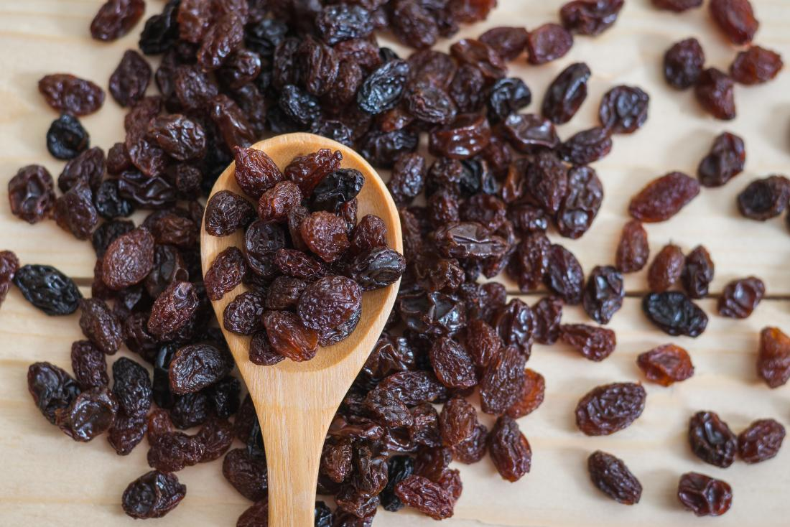
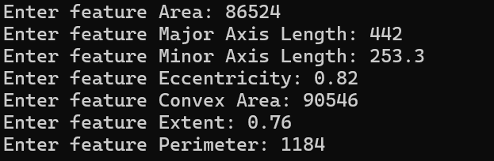

# Raisin Classification Using Support Vector Machine



## Requirements
- Python 3.9+
- `numpy`
- `scikit-learn`
- `pickle`

## Installation
1. Clone the repository
```
git clone https://github.com/BaKhoi/raisin_classification.git

cd rainsin_classification

```

2. Install required packages
```
pip install numpy scikit-learn pickle
```

## Usage
1. Run the script
```
python main.py
```

2. Enter features when prompted


3. Model Prediction


